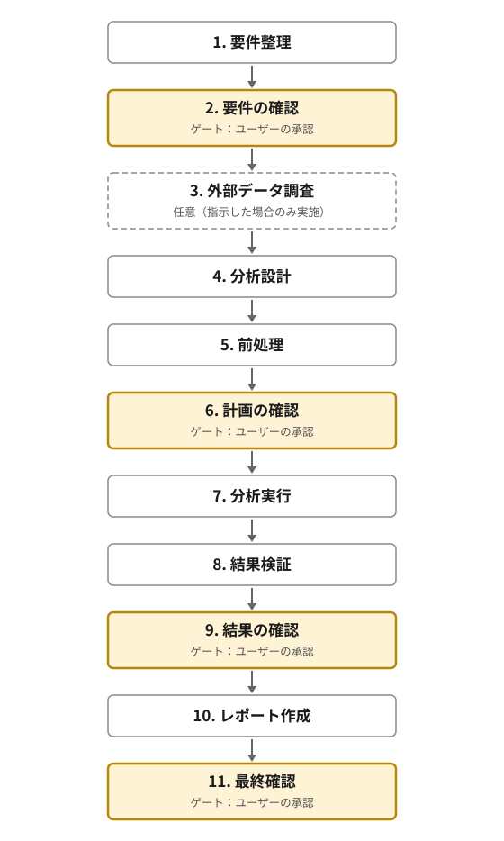

# D2PATT（α版）

D2PATT（ディーツーパット、Data-Driven Policy Analysis Teams & Tools）は、EBPMの考え方に基づき、自治体のデータ分析を支援するツールです。利用者が政策上の問題意識とデータを提示すると、要件整理から分析、結果の検証、報告書の作成までを一つの対話の中で進めます。

一般社団法人D2PA（Data Driven Policy Association）が開発しています。α版はAnthropic社のClaude Code上で動作するため、利用にはClaude Codeのサブスクリプションが必要です。

このREADMEは、D2PATTで分析を行う利用者向けの説明書です。

## 1．機能の概要

- CSV/XLSX形式のデータを受け付け、要件のヒアリング、分析計画の設計、前処理、分析、結果の検証、報告書の作成までを支援します。
- 8つの役割を持つAIエージェントが協働します。D2PATTは、利用者を案件を担当する「課長」として認識します。
- 分析手法や結果は複数のエージェントが確認します。分析工程の進行や成果物の形式検査は、AIの判断だけに頼らず、プログラムでも制御します。
- 必要に応じて、個人情報や機密情報の可能性を点検する「データ監査」と、公開オープンデータの候補を探す「外部データ調査」を行います。
- 報告書、図、集計表、分析ログ、使用したプログラムなどを、案件ごとのフォルダに保存します。

| 役割 | 主な担当 |
|---|---|
| プロジェクトマネージャー | 利用者との対話と工程の進行 |
| 分析デザイナー | 分析計画の設計と結果の解釈 |
| 計量経済の専門家 | 分析手法と分析結果の専門的な確認 |
| データアナリスト | データ処理と分析作業の管理 |
| データサイエンティスト | データ処理と分析プログラムの実行 |
| レポート作成担当 | 報告書の作成 |
| 首長 | 住民や議会に説明する観点からの確認 |
| リサーチャー | 外部データの調査 |

## 2．利用前の注意

### データの取り扱い

D2PATTはClaude Codeの対話セッションとして動作するため、エージェントに渡った情報はAnthropic社のサーバーで処理されます。入力データ全体をそのままエージェントに渡す設計にはしていません。データの加工や分析は、データサイエンティストが作成し、利用者の端末上で実行するプログラムが行います。

ただし、作業に必要な範囲で、列名、データ型、件数、欠損数、異常値、集計値、データ例などがLLMに読み込まれます。また、エージェントが定められたルールを必ず守ることは保証できません。組織の情報管理規程を確認し、外部サービスで処理して差し支えないデータだけを使用してください。

### 所要時間と利用枠

所要時間とClaude Codeの利用量は、データ量や依頼内容によって大きく変わります。α版では、1件の分析に数時間かかり、Claude Code Maxの短期間の利用枠を数割程度消費する場合があります。データ監査と外部データ調査を行う場合は、さらに時間と利用量が増えます。

### 免責

D2PATTの利用によって生じた損害や不利益について、D2PAは責任を負いません。分析結果はそのまま政策判断に用いず、データ、前提、手法、解釈を利用者自身でも確認してください。

## 3．分析の工程

分析は11の工程で進みます。このうち4つは「ゲート」と呼ばれる確認点です。D2PATTはゲートに到達すると作業を止め、利用者の承認または差し戻しを待ちます。



| 工程 | D2PATTが行うこと | 利用者が行うこと |
|---|---|---|
| 1. 要件整理 | データを受け付け、政策上の問いや報告書の読者などを確認する | 質問に回答する。冒頭でデータ監査と外部データ調査の要否を選ぶ |
| 2. 要件の確認（ゲート） | 要件のまとめと、実施した場合はデータ監査の結果を提示する | 内容を承認するか、要件整理への差し戻しを指示する |
| 3. 外部データ調査 | 公開オープンデータの候補を調べる | 要件整理で希望した場合のみ実施される |
| 4. 分析設計 | 分析計画を作成し、複数のエージェントで確認する | 原則として作業なし |
| 5. 前処理 | 派生変数の作成、マスキング、外部データの取り込みを行う | 必要に応じて、指定された外部データを取得して配置する |
| 6. 計画の確認（ゲート） | 分析計画を提示する | 計画を承認するか、分析設計への差し戻しを指示する |
| 7. 分析実行 | プログラムを作成・実行し、図表を作成する | 作業なし |
| 8. 結果検証 | 分析方法と結果を複数のエージェントで確認する | 原則として作業なし |
| 9. 結果の確認（ゲート） | 分析結果と、確認時に見解が分かれた点を提示する | 結果を承認するか、追加分析や分析設計への差し戻しを指示する |
| 10. レポート作成 | 報告書を作成し、説明の分かりやすさを確認する | 原則として作業なし |
| 11. 最終確認（ゲート） | 報告書を提示する | 報告書を承認するか、修正を指示する |

### 要件整理の冒頭で確認すること

D2PATTは最初に、次の2点を確認します。

1. **個人情報や機密情報が含まれる懸念があるか**
2. **外部データ調査が必要か**

1つ目に「懸念あり」と回答すると、データ監査を行い、個人情報などの可能性がある列を確認します。その上で、必要な列には伏せ字へ置き換えるマスキング処理などを行います。「懸念なし」と回答すると、データ監査とマスキングを省略し、すべての列を分析対象として扱います。

2つ目に「必要」と回答すると、リサーチャーが公開データの候補を調べ、採用するデータを分析計画に反映します。「不要」と回答すると、利用者が用意したデータだけで分析します。

どちらの機能も、α版では時間とClaude Codeの利用量を多く消費します。可能であれば、利用者側であらかじめ匿名化や外部データの調査を行い、これらの工程を省略することをおすすめします。

分析が計画どおりに進まない場合は、上記の工程にかかわらず、D2PATTが利用者に判断を求めます。

## 4．具体的な利用手順

### 4.1 初回利用の前に準備する

次のものが必要です。

- Claude Codeのサブスクリプションと、利用する端末に導入済みのClaude Code
- Python 3.10以上
- Pythonの実行環境を管理する `uv`
- bash環境
- 初回の環境構築に使用するインターネット接続

Pythonや`uv`やbash環境が利用できるか分からない場合は、普段使用しているClaude Codeのセッションで、次のように依頼してください。不足しているソフトウェアがある場合は、内容を確認してから導入します。

```text
D2PATTを利用する準備をします。
この端末でPython 3.10以上とuvとbashが利用できるか確認してください。
不足している場合は、公式の導入方法と必要な操作を説明し、私の確認を得てから導入してください。
bash環境が不足している場合はGit Bashを使用することを第一候補としてください。
```

### 4.2 D2PATTを取得する

配布ZIPを使う場合は、ファイルを任意の場所に保存して展開します。展開後にできる `d2patt-バージョン番号` フォルダを利用します。

Gitで取得（clone）する場合は、取得したリポジトリをそのまま使います。リポジトリのルートをClaude Codeで開いてください。

以降、このREADMEでは、どちらかの方法で用意したフォルダを「D2PATTフォルダ」と呼びます。フォルダの直下に `CLAUDE.md`、`.claude`、`tools` などがあることを確認してください。見当たらない場合は、ZIPの展開先またはcloneしたリポジトリ内で、該当するフォルダを開いているか確認してください。

### 4.3 利用環境をセットアップする（初回のみ）

D2PATTフォルダをClaude Codeで開き、次のように依頼します。

```text
このD2PATTフォルダを利用できる状態にしてください。
Python 3.10以上とuvとbashが利用できることを確認し、`uv sync --no-dev` を実行してください。
処理が終わったら、成功したかどうかと、追加で必要な操作があれば報告してください。
```

`uv sync --no-dev` は、D2PATTが必要とするPythonライブラリを `pyproject.toml` と `uv.lock` に基づいて一括で準備するコマンドです。ライブラリを一つずつ指定して導入する必要はありません。

エラーが表示された場合は、そのまま分析を始めず、エラーメッセージをClaude Codeに伝えて解消してください。セットアップに成功した後は、同じD2PATTフォルダでこの作業を繰り返す必要はありません。

### 4.4 分析するデータを配置する

D2PATTフォルダの直下に `input` フォルダを作り、分析するCSVまたはExcel（xlsx）ファイルをその中に置きます。Claude Codeに次のように依頼して作成することもできます。

```text
D2PATTフォルダの直下にinputフォルダを作成してください。
```

```text
d2patt-バージョン番号/
├── input/
│   └── 分析するデータ.csv
├── CLAUDE.md
├── .claude/
└── tools/
```

複数のCSV/XLSXを一緒に分析する場合は、同じ `input` フォルダに置き、各ファイルの関係を分析の依頼文に記載してください。分析を始める前に、「2．利用前の注意」を確認し、外部サービスで処理して差し支えないデータであることを確かめてください。

（参考）手元に分析するデータが無い場合は、D2PATTフォルダの `samples` フォルダにある架空のデータで、動作を試すこともできます。使い方は `samples/youth_survey/README.md` にあります。結果は架空のデータによるもので、あくまで動作を確かめるための参考です。

### 4.5 D2PATTフォルダでClaude Codeを起動する

Claude Codeをいったん終了した場合は、D2PATTフォルダをプロジェクトフォルダとして指定して起動し直します。別のフォルダで起動したまま分析を依頼しないでください。

起動後、現在のフォルダが正しいか不安な場合は、次のように確認できます。

```text
現在開いているフォルダがD2PATTフォルダか確認してください。
直下にCLAUDE.md、.claude、tools、inputがあることだけを確認し、データの中身はまだ読まないでください。
```

### 4.6 設定を変更する（任意）

D2PATTフォルダ直下の `config.json` では、分析設計と結果検証でレビューを繰り返す回数や、結果検証で追加できる探索的な分析の件数を設定できます。設定を変えたい場合は、テキストエディタでファイルを開き、各項目の `value` の数値を希望する値に変更して保存してください。項目の意味や値を増減した場合の影響は、それぞれの `description` に記載されています。項目名や `description` は変更せず、JSONの書式を保ってください。

設定を変更せずに使うこともできます。分析を始めるときに現在の設定を確認し、そのまま使うか変更するかを選べます。

### 4.7 分析を依頼する

D2PATTフォルダで起動したClaude Codeのセッションに、分析したい内容を送信します。自由な文章でも依頼できますが、次の項目をあらかじめ記載すると、要件整理の質問を減らせます。分からない項目や決まっていない項目は、空欄のままで構いません。

```text
inputフォルダに置いたデータの分析をお願いします。

- 自治体名：
- 政策の問い（何を判断するための分析か）：
- 分析で答えたい問い（複数可）：
- データの説明（いつ、誰に、どのように集めたか）：
- 各CSV/XLSXの説明と、複数ある場合はファイル同士の関係：
- 報告書の読者（誰に見せるか）：
- 「行動につながる分析」の意味（何が分かれば動けるか）：
- 制約（締切、使えない手法など）：
```

記入例は次のとおりです。

```text
inputフォルダに置いたデータの分析をお願いします。

- 自治体名：〇〇町
- 政策の問い：若年層の定住促進策の検討材料にしたい
- 分析で答えたい問い：地元に残りたい人と出たい人は何が違うか。進学・就職の希望と定住意向の関係はあるか
- データの説明：2026年6月に町内の15～29歳へ紙とWebで実施した意識調査。173人回答、61問。自由記述の設問が2つある
- 各CSV/XLSXの説明と、複数ある場合はファイル同士の関係：回答データが1ファイルだけある
- 報告書の読者：企画課の係内と、課長への説明資料
- 「行動につながる分析」の意味：来年度の事業の企画書に、対象と打ち手の根拠として書ける粒度
- 制約：特になし
```

依頼後は、プロジェクトマネージャーの質問に回答します。要件整理の冒頭でデータ監査と外部データ調査の要否を選び、4つのゲートでは提示された内容を確認して、承認または差し戻しを指示してください。

## 5．成果物の確認

分析を開始すると、D2PATTフォルダの `projects/日付_連番/` に案件フォルダが作成されます。`input` に置いた元データは、受付後に案件フォルダ内の `input/` へ移動します。分析結果は、案件フォルダ内の `output/` に保存されます。

```text
projects/260816_01/
├── input/                         元のCSV/XLSX
├── external/                      取得した外部データ
└── output/
    ├── report_draft.md            報告書の本文
    ├── report.pdf                 報告書のPDF（希望した場合）
    ├── report.docx                報告書のWord（希望した場合）
    ├── figures/                   図（PNG）
    ├── tables/                    集計表（CSV）
    ├── scripts/                   分析に使用したプログラム
    ├── analysis_log.md            分析ログ
    ├── analysis_brief.json        分析計画書
    ├── requirements_summary.json  要件のまとめ
    └── data_audit.json            データ監査の結果
```

最終承認のあと、報告書をPDFとWordでも保存するかを尋ねられます。PDFは配布用、Wordは手直し用です。Wordを直しても `report_draft.md` は変わりません。あとから書き出したいときは、セッションで `/report-export` と入力してください。同じ名前のファイルが既にあるときは、上書きするか、日時を付けた別名（`report_日時.pdf` など）で残すかを尋ねられます。

ファイル名がドット（`.`）で始まるものは、D2PATTの内部管理用ファイルです。分析の完了後は、案件フォルダの名前を変更しても構いません。

## 6．ライセンス

- 本ソフトウェアは、PolyForm Noncommercial License 1.0.0の下で提供されています。条文の全文と権利者の表示は、配布物に同梱される `LICENSE` を参照してください。
- ソースコードを公開していますが、オープンソースではありません。
- 自治体、教育機関、非営利組織による利用を含め、非商用の利用は自由です。
- 商用利用には個別のライセンスが必要です。一般社団法人D2PA（contact@d2pa.org）にお問い合わせください。

## 7．D2PAについて

一般社団法人D2PA（Data Driven Policy Association）は、データ実証を通じて自治体の政策形成を支援する非営利型の一般社団法人です。

- ウェブサイト：[https://d2pa.org](https://d2pa.org)
- 連絡先：contact@d2pa.org
